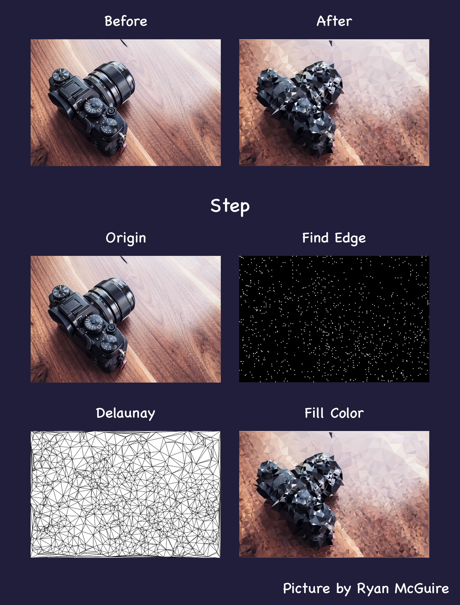

<p align="center">

</p>

<p align="center">
<a href="https://travis-ci.org/DevinShine/Porygon"></a>
<a href="https://raw.githubusercontent.com/DevinShine/Porygon/master/LICENSE"></a>
<a href="https://github.com/DevinShine/Porygon"></a>
<a href="https://travis-ci.org/DevinShine/Porygon/"></a>
<a href="https://www.apple.com/nl/ios/"></a>
<a href="#"></a>
<a href="https://codebeat.co/projects/github-com-devinshine-porygon-master"></a>
</p>

Porygon is a library for generate low-poly style images. It's algorithm is based on this [paper](http://ieeexplore.ieee.org/document/7314186/) and  [Polyvia](https://github.com/Ovilia/Polyvia). The Delaunay algorithm used is this [library](https://github.com/eloraiby/delaunay).

如果你看的懂中文，你可以看我的这篇[文章](http://www.jianshu.com/p/2438c99e519e)，里面会介绍实现的思路。
## Effect


### Detail

* Get the edge points
   * Use Sobel to find the edge vertices and randomly take a few vertices
   * Generate random vertices using Poisson samples
   * Merge these vertices
* Use Delaunay to form a number of triangles
* Get the color from the center of the triangle and fill the color

## Requirements

* iOS 6.0+
* Xcode 7.0+

## Installation

### CocoaPods

1. Add `pod 'Porygon'` to your Podfile.
2. Run `pod install` or `pod update`.
3. Import <Porygon/Porygon.h>.

### Manually

1. Download all the files in the **Sources** subdirectory.
2. Add the source files to your Xcode project.
3. Link with required frameworks:
	* UIKit
4. Import `DVSPorygon.h`.

## Useage

### Easy use
``` objc
DVSPorygon *porygon = [[DVSPorygon alloc] init];
UIImage * lowPolyImage = [porygon lowPolyWithImage:[UIImage imageNamed:@"camera"]]; // get low poly image
```

### Configuration parameters

``` objc
DVSPorygon *porygon = [[DVSPorygon alloc] init];
// edge vertex count
porygon.vertexCount = 10000;
// randomly add the number of vertices
porygon.randomCount = 200;
// show wireframe effects
porygon.isWireframe = true;
UIImage * lowPolyImage = [porygon lowPolyWithImage:[UIImage imageNamed:@"camera"]]; // get low poly image
```

## License
Porygon is provided under the MIT license. See LICENSE file for details.

